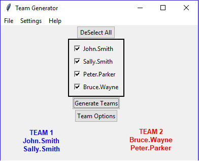

# Team Generator

A Python 3 Program that Generates Teams based on number of teams required.

This program can distribute users into as many teams as needed.

# TKinter

> Note: The GUI was a beginner project using tkinter. For anyone else who wants to start learning to make GUI's, I would **strongly** reccomend Pyside2 as the GUI library instead of tkinter.

The GUI only allows for a maximum of 10 teams, however you can edit the JSON file to select as many as needed.

TKinter is a 2 step process

1. Create the object
2. Display the object

## Input File (JSON)

A JSON file `team_list.json`is used to generate / save team data.

Example of basic team:

```json
{
  "names": [
    "John.Smith",
    "Sally.Smith",
    "Darrel.Calhoun",
    "Siraj.Zhang",
    "Nick.Coates",
    "Lukas.Barr",
    "Peter.Parker",
    "Bruce.Wayne"
  ],
  "numOfTeam": 2,
  "balance": []
}
```


---

A `balance` option exists to try to balance teams out where a skill gap exists amongst members and to try to reduce a "steam roll" from happening. The program will try to separate these members equally.

```json
{
  "names": ["John.Smith", "Sally.Smith", "Peter.Parker", "Bruce.Wayne"],
  "numOfTeam": 2,
  "balance": ["Sally.Smith", "Bruce.Wayne"]
}
```



<!--  -->

# Slack Integration

Create your own APP and setup `Incoming Webhooks`

```
The Url will look like: https://hooks.slack.com/services/<ID1>/<ID2>/<ID3>
```

Go to `Settings` > `Set Slack key` and enter in `<ID1>/<ID2>/<ID3>` including the slashes


